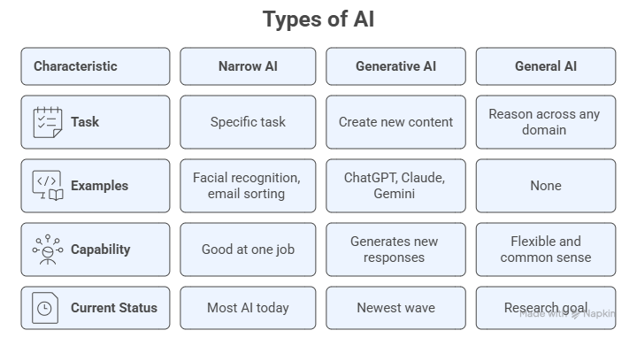
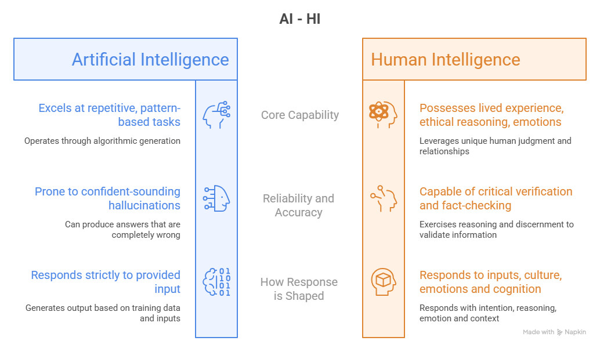

# Class 1: Understanding AI Without the Fear

You have probably heard a lot about Artificial Intelligence lately, in the news, at work, from family, or on social media. Some of what you have heard may feel exciting. Some of it may feel overwhelming or even a little scary. This first class is designed to cut through the noise, replace confusion with clarity, and replace fear with curiosity.

By the end of this class, you will understand what AI is, how it works in plain everyday language, where it already shows up in your life, and what it cannot do. You will also know how to communicate with AI clearly and effectively — the essential skill that makes every other use of AI more powerful. Most importantly, you will have your very first real conversation with an AI tool, and you will have done it confidently, on your own.

:::{note}
**The most important thing to know before we begin:** You do not need to be technical, mathematical, or "good with computers" to use AI tools well. Curiosity and common sense is part of what you need.
:::

## Learning Objectives

By the end of this class, you will be able to:

1. Identify AI tools and systems you already interact with in daily life.
2. Explain what Artificial Intelligence is in plain, jargon-free language.
3. Describe how AI works at a high level, without any math or coding.
4. Distinguish between different types of AI, particularly Generative AI.
5. Name the most common AI chatbot tools and describe what each is used for.
6. Write and refine your first AI prompts to complete a real-world task.
7. Apply different prompt patterns to get more targeted, useful responses from AI.
8. Use context engineering to adapt AI's tone, role, and output to your specific situation.
9. Use meta-prompting to let AI help you design or improve your own prompts.
10. Reflect critically on what AI does well and what it gets wrong.

## Part I — AI is Already in Your Life

Before we define AI, let us start somewhere more personal: your own daily routine.

### 1.1 You Are Already an AI User

Most people who say "I have never used AI" are surprised to discover they use it every single day, they just did not know it had a name.

Consider a typical morning:

- You wake up and check the **weather app** → AI predicted that forecast.
- You open **email** and notice that spam never reaches your inbox → AI filtered it out.
- You search for something on **Google or Bing** → AI ranked those results for you.
- You open **Spotify, YouTube or Netflix** → AI selected those recommendations based on what you have watched or listened to before.
- You use **Google Maps** to avoid traffic → AI calculated the fastest route in real time.
- You ask **Siri, Alexa, or Google** a question → AI understood your voice and generated an answer.

None of this required you to understand AI. You were already benefiting from it.

> **Key insight:** AI is not a single thing that lives in a robot. It is a set of technologies woven quietly into the tools you already use every day.

### 1.2 What is Artificial Intelligence? A Plain Language Definition

Here is the simplest honest definition:

> **Artificial Intelligence (AI) is software that learns from examples or by interacting with the environment, and uses what it learned to make decisions, answer questions, or create new content. AI solutions are programmed to learn how to solve a problem, instead of being programmed to do so.**

That is it. No magic. No consciousness. No feelings. Just very sophisticated learning machines.

Think of it this way: when you were a child learning to recognize cats, someone showed you many pictures and said "cat" or "not a cat." Over time, you learned to spot a cat anywhere, even cartoon cats, tiny cats, cats in the dark. This is one of the many ways we can learn, and AI can learn the same way.

**What makes AI different from regular software?**

| Regular Software | Artificial Intelligence |
| :--- | :--- |
| Is programmed to do something specific | Learns what it should do based on examples or interactions with the environment |
| Does exactly what it is told | Can adapt and improve over time |
| Cannot handle situations it was not programmed for | Can generalize to new, unseen situations |
| Output is fixed and predictable | Output can vary and surprise even its creators |

A calculator, for example, is not AI, it follows precise rules every time. A spam filter that learns which emails are junk based on your behavior *is* AI.

### 1.3 How AI Works: The Big Picture

You do not need to understand the math. Here is the three-step process that describes how almost every AI system works:

**Step 1 — We give it inputs (signals, examples or data)**  
AI systems are trained on input data: text, images, sounds, numbers, etc. This is called *training data*. The more representative the data, the better the AI learns.

**Step 2 — AI finds patterns**  
Algorithms scan all those examples and identify patterns, similarities, and relationships. This happens automatically and at incredible scale.

**Step 3 — AI applies what it learned**  
When you ask AI a question or give it a task, it uses the patterns it learned during training to generate a response, make a decision, or create content.

:::{important}
AI is making its best guess based on patterns, it is not accessing the internet in real time (unless specifically told to), it is not thinking, and it does not "know" things the way humans do. It can be wrong and thus your judgment always matters.
:::

### 1.4 Types of AI: A Simple Map

The word "AI" covers many different technologies. Here are the ones most relevant to everyday life:

**Narrow AI (most AI you encounter today)**  
Designed to do one specific task very well. Examples: facial recognition in your phone, the algorithm that sorts your email, a chess-playing program. Narrow AI is extremely good at its one job but cannot do anything outside of it.

**Generative AI (the newest wave and what this program focuses on)**  
A type of AI that can *create* new content: text, images, music, video, code, and more. When you hear about ChatGPT, Claude, Gemini, or Copilot, these are all Generative AI tools. Instead of just analyzing, segmenting or classifying, they generate something new in response to what you ask.

**General AI (does not exist yet)**  
A hypothetical AI that could reason across any domain the way a human can, with flexibly, common sense, and across wildly different situations. This remains a research goal, not a current reality.



:::{info}
💡 **What this means for you:** For this program, we are focused almost entirely on **Generative AI**, specifically the AI models and creative tools you can access today, for free or at low cost, without any technical background.
:::

### 1.5 What AI Is Not

As important as understanding what AI is, is understanding what it is not. Several common beliefs about AI are simply wrong, and those misunderstandings are the source of most unnecessary fear.

**AI is not conscious or self-aware.**  
There is no awareness, no feelings, and no inner experience inside an AI system. When ChatGPT says "I think..." or "I feel...", it is generating text that sounds human because it was trained on human writing. It is not actually thinking or feeling anything.

**AI is not always right.**  
This is one of the most important things to internalize. AI can produce confident-sounding answers that are completely wrong. This phenomenon even has a name: *hallucination*. We will practice spotting and verifying AI output throughout this program.

**AI is not reading your mind.**  
AI responds to exactly what you type. If your question is vague, the answer may be vague. If your question is specific and well-structured, the answer may be far more useful. This is why learning to communicate well with AI matters.

**AI is not going to replace you.**  
AI excels at repetitive, pattern-based tasks. What it cannot replicate is your judgment, your lived experience, your relationships, your creativity, and your ethical reasoning. The realistic picture is AI as a powerful assistant, not a replacement.



### 1.6 Common Myths About AI - Busted

| The Myth | The Reality |
| :--- | :--- |
| "AI knows everything." | AI knows patterns from its training data. It has a knowledge cutoff and can confidently say false things. |
| "You need to be tech-savvy to use AI." | If you can type a sentence, you can use AI. The skill is knowing what to ask, not how to code. |
| "AI is always objective and unbiased." | AI learns from human-generated data, which contains human biases. AI can and does reflect those biases. |
| "AI is dangerous and out of control." | Current AI tools are software applications with significant limitations. They require human input and oversight. |
| "AI will make my job disappear overnight." | Change is gradual. AI is more likely to change *how* you work than to eliminate the need for you entirely. |
| "If AI said it, it must be true." | Not always. Always verify important AI outputs before acting on them. |

## Part II — Meeting the Tools: Your AI Toolkit

Now that you understand what AI is, let us look at the specific tools you will be working with throughout this program.

:::{note}
Many of the tasks that we are going to discuss here can be performed by specialized GenAI tools. Despite that, our program choice was to show you how to do the same tasks using general-purpose AI models, whenever it is possible. This will give you the knowledge and skills necessary to learn how to use AI independently of specialized AI tools.
:::

### 2.1 The AI Tool Landscape

There are many general-purpose AI apps and tools available today. The good news is that they work in very similar ways and if you learn to use one, you will adapt quickly to the others. Furthermore, if you know how to perform a task using general-purpose models, you can use any specialized AI tool that you want, it is just a matter of learning how to operate them. 

**The major general-purpose AI platforms:**

| Platform | Made By | Access | Best Known For |
| :--- | :--- | :--- | :--- |
| **ChatGPT** | OpenAI | Free / Paid (Plus) | Most widely used; versatile; strong general tasks |
| **Claude** | Anthropic | Free / Paid (Pro) | Long documents; thoughtful, nuanced responses |
| **Gemini** | Google | Free / Paid | Integration with Google Workspace (Docs, Gmail) |
| **Copilot** | Microsoft | Free / Paid | Integration with Microsoft 365 (Word, Excel, Outlook) |
| **Perplexity** | Perplexity AI | Free / Paid | Web search + AI answers with cited sources |
| **Grok** | x.ai | Free / Paid | Images and videos; integrated with X |

:::{info}
**Which one should you use?** For this program, any of the free versions of the general-purpose models will work. If you use Google products at work, Gemini will feel familiar. If you use Microsoft Office, Copilot is already inside your tools.
:::

### 2.2 Basics of Prompt Engineering

A **prompt** is simply what you type to an AI. It is your instruction, question, or request.

Think of it like talking to a very knowledgeable assistant who has just started working with you today. They have never met you, they do not know your preferences, and they take your words literally. The more clearly you explain what you need, the better the result.

**The five ingredients of a strong prompt:**

| Ingredient | What it Does | Example |
| :--- | :--- | :--- |
| **Role** | Tells AI who to act as | *"Act as a friendly travel agent..."* |
| **Context** | Gives background information | *"I am planning a 5-day trip to Portugal with my elderly mother..."* |
| **Instruction** | Specifies exactly what to do | *"...create a day-by-day itinerary..."* |
| **Input Data** | The content the model will work with | *"Here is a list of places we would like to visit"* |
| **Format** | Describes how to present the answer | *"...organized by day, with morning, afternoon, and evening suggestions."* |

You do not always need all of them, but the more you include, the better the AI's response tend to be.

**Weak prompt vs. strong prompt — a comparison:**

*Weak:*
```
Tell me about Portugal.
```

*Strong:*
```
Act as a friendly travel agent. I am planning a 5-day trip to Lisbon, Portugal 
in October with my 72-year-old mother who has difficulty walking long distances. 
We enjoy history, local food, and calm neighborhoods. 
Create a day-by-day itinerary with low-activity options, including restaurant 
suggestions for each evening. Format it as a daily plan with morning, 
afternoon, and evening sections.
```

The second prompt gives the AI a role, context, a specific task, input data, and a format. The output will be dramatically more useful and assertive.

### 2.3 The AI Workspace: Your Personal Learning Environment

One of the most powerful, and most overlooked, features of modern AI platforms is the ability to create a **persistent AI Workspace**: a dedicated space where your AI assistant remembers who you are, what you are working on, and what you have already done together across multiple conversations.

Think of it this way:

> A generic AI chat is like calling a helpline and starting from scratch every time. An AI Workspace is like having a knowledgeable friend you have been talking with for long, one who remembers your preferences, knows your situation, and picks up exactly where you left off.

In this program, you will set up your **AI Workspace** at the beginning of Class 1 and use it across all classes. As you complete each activity and build your personal AI toolkit, you will bring that context into your Workspace. So, by the last class, your AI Workspace knows your goals, your preferred tools, your prompt library, and your learning journey.

#### Setting Up Your AI Workspace

Different AI platforms offer this feature under different names, but they all work the same way:

| Platform | Workspace Feature | How to Access |
|---|---|---|
| Claude (Anthropic) | Projects | claude.ai → New Project |
| ChatGPT (OpenAI) | Projects | chatgpt.com → Projects |
| Perplexity | Spaces | perplexity.com → Spaces |
| Grok (X.ai) | Projects | x.ai → Projects |
| Copilot (Microsoft) | Projects | copilot.microsoft.com → Projects |

Regardless of the platform you choose, the setup follows the same simple logic:

1. **Create a new Workspace** and give it a meaningful name, such as "My AI Learning Space" or "AI for Everyday Life — [Your Name]."

2. **Write a short introduction about yourself.** This is a brief paragraph, two to four sentences, that tells the AI who you are, what you are hoping to learn, and how you plan to use it. You will draft this in the first hands-on activity of this class.

3. **Add context as you go.** After each class, bring your notes, your best prompts, and your key takeaways back into the Workspace. The AI will build on what you have already shared.

4. **Run all program activities inside this Workspace**, not in a generic chat window. Start a new conversation (thread) for each class or topic, and give it a descriptive name. This is what keeps your experience organized and makes the AI genuinely useful over time, rather than just a one-off tool.

**Why this matters:**

> A generic AI chat has no memory of you and starts fresh every time. Your AI Workspace does not. The difference between a frustrating AI experience and a genuinely helpful one is context, and you are going to build that context deliberately, class by class.

By the end of this program, your Workspace will contain your personal introduction, your preferred communication style, your most useful prompts, and a set of everyday AI habits that work for your life. That is not just a learning exercise, it is a practical tool you will keep using long after the program ends.


:::{seealso}
**A Glimpse of What's Coming**

Now that you know the ingredients of a strong prompt, here is a taste of what becomes possible once you put them together in a real conversation.

In Class 2, you will work through a step-by-step exercise planning a multi-generational family trip through Europe — using ten carefully designed prompts that build on each other, just like briefing a knowledgeable travel agent over several meetings. Along the way, you will learn how to:

- Set up context so the AI keeps the whole group in mind throughout the conversation
- Build a plan layer by layer — overview first, then details, then personalisation
- Ask the AI to focus on different people's needs separately
- Prompt the AI to *challenge its own suggestions* and flag what might go wrong
- Turn the conversation into a shareable, practical artefact you could use on the trip

For now, the single most important habit to build is what you are about to practise in Activity 2: **giving AI enough context, then refining as you go.** Everything else grows from there.
:::


### 2.4 🛠️ Activity 1: Teach AI to Know You

**Goal:** Experience how context changes everything — and practice refining a response.

**Step 1 — Ask AI for a recipe**  
Type this prompt:
```
Suggest a recipe for dinner tonight.
```

**Step 2 — Refine with context**  
Now try:
```
I have chicken, garlic, tomatoes, pasta, and olive oil in my kitchen.
I am cooking for two people and need something ready in under 30 minutes.
I prefer Mediterranean-style food. Please suggest one recipe with 
step-by-step instructions.
```

**Step 3 — Push it further**  
If the recipe includes something you do not like or do not have, type a follow-up:
```
I do not have [ingredient]. What can I substitute?
```
or:
```
Can you make this version suitable for someone who does not eat onions?
```

**Discussion questions:**
- How did the first and second responses compare?
- What happened when you pushed back or asked for a change?
- What does this tell you about how AI conversations work?

> 💡 **Key insight:** AI conversations are *iterative*. You do not have to get the perfect prompt on your first try. Ask, refine, push back, and redirect — just like you would with a human assistant.

## Part III — Communicating With AI: Prompt Literacy

Now that you know what AI is, where it already appears in your life, and which tools are available, it is time to learn the most important skill of all: how to talk to it well.

This part takes the five prompt ingredients you learned in Section 2.2 one step further. You will discover the *patterns* experienced AI users rely on, learn how to give AI the full picture so it responds with precision, and find out how to let AI itself help you write better prompts.

### 3.1 Prompt Patterns: Choosing the Right Approach

A **prompt pattern** is a reusable structure you can adapt to different situations. Think of them like sentence templates for communicating with AI. You do not need to memorize all of them, you just need to know which one fits the job.

**The five most useful prompt patterns for everyday tasks:**

| Pattern | When to Use It | Example |
| :--- | :--- | :--- |
| **Instructional** | Simple, clear tasks with a single output | *"Summarize this email thread in three bullet points."* |
| **Role-Based** | You want a specific tone, expertise, or perspective | *"Act as a professional editor. Improve the tone of this email."* |
| **Chain-of-Thought** | Complex tasks where reasoning matters | *"Think step by step. First identify the main issue in this complaint, then suggest a response."* |
| **Few-Shot** | You want the AI to match a specific style or format | *"Here is an example of the tone I want: [example]. Now write a similar email for this situation: [situation]."* |
| **Iterative** | You want to refine the output through conversation | Start with a draft, then: *"Make it shorter." / "Change the tone to be warmer." / "Add a call to action."* |

:::{tip}
You do not need to pick just one pattern. The most powerful prompts often combine several, for example, a *role-based* prompt with *chain-of-thought* reasoning and a specific *output format*.
:::

### 3.2 Context Engineering: Giving AI the Full Picture

**Prompt engineering** is about how you phrase your instruction. **Context engineering** goes further, it is about everything that *surrounds* your instruction: the role you assign, the background you provide, the audience you define, and the constraints you set.

Think of the difference this way:

> Prompt engineering is choosing the right words.  
> Context engineering is making sure the AI understands the whole situation before it starts.

**The key elements of context:**

| Element | What It Does | Example |
| :--- | :--- | :--- |
| **Role** | Defines who the AI is acting as | *"You are a patient and professional customer service representative..."* |
| **Audience** | Defines who will read the output | *"...writing to a frustrated customer who has been waiting two weeks for a refund."* |
| **Purpose** | Clarifies the goal | *"The goal is to acknowledge the issue, apologize sincerely, and offer a clear next step."* |
| **Tone** | Sets the emotional register | *"Keep the tone warm, empathetic, and professional, never defensive."* |
| **Constraints** | Sets limits on length, content, or style | *"Keep the email to three short paragraphs. Do not promise a specific timeline."* |

**Context engineering in action — a before and after:**

*Without context:*
```
Write an apology email to a customer.
```

*With context:*
```
You are a customer service representative for a small online retail business.
A customer named Maria ordered a birthday gift two weeks ago and it has not arrived.
She has emailed twice and is understandably frustrated.
Write a professional, warm, and sincere apology email that:
- Acknowledges the delay and her frustration without making excuses
- Confirms you are investigating the shipment status
- Offers her a 15% discount on her next order as a goodwill gesture
- Keeps the tone empathetic and never defensive
- Is no longer than three short paragraphs
```

The second version gives the AI everything it needs to produce something genuinely useful, not just a generic apology.

### 3.3 Meta-Prompting: Let AI Create and/or Improve Your Prompts

One of the most powerful and underused techniques is **meta-prompting**: asking AI to help you write or improve a prompt before you use it.

This is especially helpful when you know what you want to accomplish but are not sure how to phrase it.

**Meta-Prompt Template — Create a Prompt from Scratch:**
```
I want to use AI to help me with the following goal:
[DESCRIBE WHAT YOU WANT TO ACCOMPLISH]

My audience is: [WHO WILL READ OR BENEFIT FROM THE OUTPUT]
The tone should be: [FORMAL / FRIENDLY / PERSUASIVE / INFORMATIVE / ETC.]
The format I need is: [EMAIL / LIST / PLAN / SUMMARY / SOCIAL POST / ETC.]
Any important details or constraints: [LENGTH, STYLE, THINGS TO INCLUDE OR AVOID]

Based on this, write me a strong, ready-to-use prompt I can give to an AI tool.
```

**Example**: A small business owner wants to use AI to announce a new product on social media but doesn't know how to start.

**Using the meta-prompt**:
```
I want to use AI to help me write a prompt with the following goal:
Announce a new product on social media.

My audience is: local customers in Southwest Florida, mostly 30–55 years old
The tone should be: excited, friendly, and a little playful
The format I need is: a short social media post (Instagram/Facebook)
Any important details or constraints: the product is a new tropical fruit smoothie at
my café, I want to include a call to action, keep it under 100 words, and use 2–3 emojis
```

**Meta-Prompt Template — Improve a Weak Prompt:**
```
Here is a prompt I wrote:

[PASTE YOUR PROMPT HERE]

My goal is: [DESCRIBE WHAT YOU ARE TRYING TO ACHIEVE]
My audience is: [DESCRIBE WHO WILL READ THE OUTPUT]

Please rewrite this prompt to make it more effective. 
Explain what you changed and why.
```

**Example:** A participant in a community organization wants AI to help write a fundraising email but is not sure how to prompt it:

*Their original prompt:*
```
Write a fundraising email.
```

*After using the meta-prompt:*
```
You are a warm and persuasive nonprofit communications writer.
Write a fundraising appeal email for a local food bank serving Lee County, Florida.
The email is addressed to past donors who gave between $25 and $100 last year.
The goal is to inspire a repeat gift before the end of the fiscal year.
Include: a compelling opening with a specific story or statistic, a clear call to action 
with a donation link placeholder, and a warm, grateful closing.
Tone: heartfelt, urgent but not pushy. Length: 250–300 words.
```

The meta-prompt transformed a one-line instruction into a fully engineered prompt, and the resulting email was ready to use with minimal editing.

:::{tip}
Next time you feel stuck on how to ask AI something, type: *"Help me write a better prompt to accomplish this goal: [your goal]."* AI will ask you clarifying questions or suggest an improved prompt directly.
:::

### 3.4 🛠️ Activity 2: Prompt Pattern Practice

**Goal:** Experience how different prompt patterns produce different responses to the same task.

**The task:** Ask AI to help you write a short professional bio for yourself (or an imaginary persona).

**Round 1 — Instructional:**
```
Write a short professional bio for me.
```

**Round 2 — Role-Based:**
```
You are a professional copywriter specializing in personal branding.
Write a compelling 100-word professional bio for [name], 
who works as a [job title] with [X] years of experience in [field].
Tone: confident, approachable, and human.
```

**Round 3 — Iterative refinement:**
After reading Round 2's output, give one follow-up instruction:
```
Make it sound less formal and more conversational.
```
Then another:
```
Add a sentence about what this person is passionate about outside of work.
```

**Reflect:**
- Which round produced the most useful result?
- How much did each follow-up instruction change the output?
- What does this tell you about how AI conversations work?


## Part IV — Reflection and Wrap-Up

### 4.1 What All These Examples Have in Common

Looking back at everything we covered in this class — the AI tools already in your life, how AI learns, and the hands-on demos — a pattern emerges.

Every AI tool we explored:

- **Supports your decisions** — it offers options, but the final choice is always yours.
- **Adapts to your context** — the more you tell it, the more relevant its response.
- **Reflects your inputs** — the quality of the output depends directly on the quality of what you put in.
- **Requires your judgment** — AI is the assistant; you are the one accountable for what happens next.

This is the heart of **Human-Centered AI**: the technology serves the human, not the other way around.

### 4.2 Your Personal Takeaways

Before moving on, take a moment to write down your own answers to these three questions:

1. **One thing I learned today that surprised me:**  
   _________________________________

2. **One AI tool I want to try on my own this week:**  
   _________________________________

3. **One question I still have about AI:**  
   _________________________________

Hold onto these — we will revisit them at the end of Class 4.

### 4.3 Reflection

> How does knowing that AI is pattern recognition — not magic — change how you feel about using it?  
> What responsibility do you think AI users have when sharing AI-generated content with others?  
> Looking at the myths we busted today, which one had the biggest effect on how you thought about AI before this class?

There are no wrong answers to these questions. The goal is to develop a thoughtful, grounded relationship with AI technology — one based on understanding rather than hype or fear.

### 4.4 What Is Coming in Class 2

In the next class, we will put everything you have learned to work on the tasks that fill most people's daily and professional lives:

- **Emails** — drafting, rewriting, improving tone, and responding to difficult messages.
- **Documents** — summarizing long content, creating reports, and improving written communication.
- **Search** — using AI to find flights, local services, and real-world information more efficiently than a search engine.
- **Spreadsheets** — asking AI to explain data, generate formulas, and simplify numbers for you.
- **Career** — tailoring your CV, writing cover letters, and preparing for interviews with AI support.

By the end of Class 2, you will have used AI to complete real tasks you face every week — and you will walk away with a personal Prompt Library of tested, ready-to-use templates.

## 📋 Class 1 Summary Checklist

Before you move on, confirm that you can do the following:

- [ ] Name at least three AI tools you already use in daily life.
- [ ] Explain what AI is in one sentence, without using technical jargon.
- [ ] Describe how AI learns in three simple steps.
- [ ] List at least three things AI is *not* (bust three myths).
- [ ] Name two or more AI chatbot platforms and describe what each does.
- [ ] Write a prompt using at least three of the five ingredients (Role, Context, Task, Input Data, Format).
- [ ] Name and apply at least three prompt patterns (instructional, role-based, iterative).
- [ ] Use context engineering to set role, audience, tone, and constraints in a prompt.
- [ ] Use a meta-prompt to let AI improve or generate a prompt for you.
- [ ] Reflect on one thing AI did well and one thing it got wrong in your hands-on activities.

## 📘 Further Reading

Learners who wish to explore the ideas introduced in this class are encouraged to consult:

- **Mollick, E. (2024).** *Co-Intelligence: Living and Working with AI.* Portfolio/Penguin. *(Highly recommended — written for a general audience.)*
- **Senior Planet. (2024).** *AI Guide for Older Adults.* seniorplanet.org.
- **Anthropic. (2024).** *What is Claude?* claude.ai/about.
- **OpenAI. (2024).** *How ChatGPT Works.* openai.com.
- **Google. (2024).** *Introduction to Generative AI.* Google Cloud Skills Boost (free, no technical background required). cloud.google.com/training.
- **De Castro, L. N. (2026).** *Exploratory Data Analysis: Descriptive Analysis, Visualization, and Dashboard Design.* CRC Press.
- **Dendritic Institute. (2025).** *AI Literacy Program — Module 2: What is AI and Its Many Branches.* FGCU AI Academy.
- **Prompt Engineering Guide. (2024).** promptingguide.ai — a free, comprehensive reference for prompt patterns and techniques.
- **Dendritic Institute. (2025).** *AI Literacy Program — Module 5: Fundamentals of Prompt Engineering.* FGCU AI Academy.
- **Dendritic Institute. (2025).** *AI Literacy Program — Module 6: Context Engineering.* FGCU AI Academy.

```{note}
*Class 1 is part of the AI for Everyday Life Program, offered by the Dendritic Institute for Human-Centered AI & Data Science at Florida Gulf Coast University. No technical background is required. All hands-on activities can be completed using free AI tools.*
```
